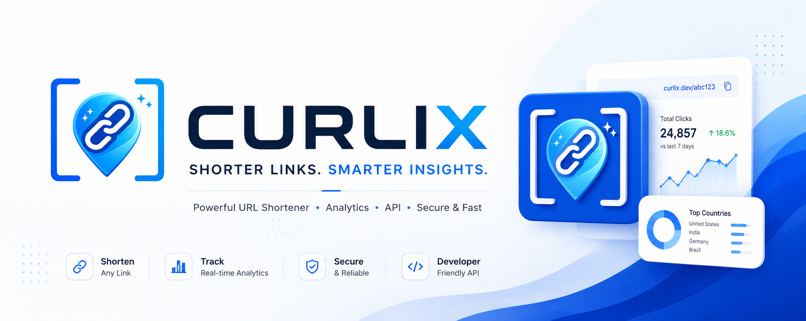
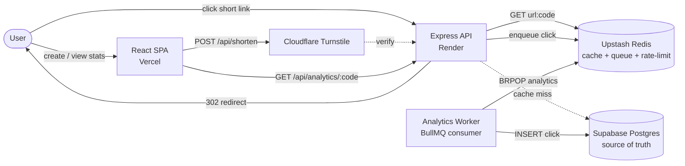

<div align="center">
  

  <h3>A production-grade URL shortener with sub-10 ms redirects, async analytics, and zero-account UX.</h3>

  <p>
    <a href="https://curlix.vercel.app"></a>
    
    
    
    
    
  </p>
</div>

---

## What is Curlix?

Curlix shortens URLs without making anyone sign up. Each link is owned by a **bearer token** issued at creation time — no email, no password, no session. Clicks are served from a Redis cache in front of Postgres, and analytics events are written through a BullMQ queue so they never block the redirect path.

It's small enough to read end-to-end in an afternoon and architected the way you'd build it at scale.

## Live Demo

> **App:** https://curlix.vercel.app
> **API:** https://curlix-backend.onrender.com/health/ready

## Architecture



**Hot path** (the redirect): one Redis `GET`, one async enqueue, return `302`. No database hit on the happy path.

## Tech Stack

| Layer | Choice | Why |
|---|---|---|
| Frontend | React 18 + Vite + Tailwind | Fast dev loop, zero runtime overhead |
| Backend | Node.js 18 + Express | Boring, fast enough, easy to deploy |
| Cache & queue | Upstash Redis (ioredis + BullMQ) | One dependency, two responsibilities |
| Database | Supabase Postgres | Managed PG with pgBouncer pooling |
| Bot protection | Cloudflare Turnstile | No-CAPTCHA verification, free tier |
| Hosting | Vercel (web) + Render (API) | Free tiers, autodeploy on push |

## How a Click Flows Through the System

This is the path a click takes when a user hits a Curlix short URL:

1. **Request hits Express** → `GET /:code` handler in [`urlController.js`](backend/src/controllers/urlController.js).
2. **Rate limiter** ([`rateLimiter.js`](backend/src/middleware/rateLimiter.js)) increments a Redis counter keyed by client IP. Fails open if Redis is unreachable so a Redis blip doesn't take down redirects.
3. **Cache lookup** in [`urlService.js`](backend/src/services/urlService.js) → Redis `GET url:abc12345`. On hit, we have `{longUrl, expiresAt, urlId}` in <5 ms.
4. **Cache miss** → fall through to Postgres: `SELECT long_url, expires_at FROM urls WHERE short_code = $1 AND is_active = true`. Result is written back to Redis with a 24-hour TTL.
5. **Expiry check** is enforced in code rather than at the DB — the cached record carries `expiresAt` so we don't need a query just to expire links.
6. **Enqueue analytics** ([`analyticsQueue.js`](backend/src/queues/analyticsQueue.js)) → fire-and-forget `BullMQ.add('click', payload)`. Errors here are swallowed; analytics must never break a redirect.
7. **Respond with `302`** to the long URL. The user is gone.
8. **Worker drains the queue** ([`analyticsWorker.js`](backend/src/workers/analyticsWorker.js)) → parses the user-agent, hashes the IP (SHA-256, no raw IP storage), inserts into the `analytics` table. Failed jobs retry 3× with exponential backoff.

The redirect path touches only Redis. The DB is touched only on cache miss and only by the worker.

## Features

- **No accounts** — every link is owned by a bearer token shown once at creation, persisted client-side in `localStorage`. Lose the token, lose the link.
- **Custom aliases** with collision detection (`curlix.io/launch` vs. an 8-char nanoid).
- **Expiring links** — set a TTL at creation, enforced cheaply on the cached record.
- **Link editing & deletion** — update or delete any link using its owner token (`PATCH /api/links/:code`, `DELETE /api/links/:code`). Mutations also invalidate the Redis cache immediately.
- **Per-link analytics** — total clicks, daily breakdown (last 30 days), device split (desktop / mobile / tablet), and top referrers. Charts rendered with Recharts.
- **QR code generation** — every shortened link instantly generates a QR code, toggleable directly from the result panel.
- **One-time token reveal** — the owner token is shown exactly once after creation with a copy button and a clear warning. It is never shown again.
- **Request trace panel** — after shortening, a developer-readable trace shows the HTTP method, status code, short code, storage backend, and cache TTL.
- **Dark / light theme** — system-aware default, persisted in `localStorage`, toggleable from the navbar.
- **Tiered rate limits** — different windows for create / redirect / mutate, all enforced via Redis `INCR + EXPIRE`.
- **Bot protection** — Cloudflare Turnstile gate on the create endpoint.
- **Health endpoints** — `/health` for liveness (used by UptimeRobot / load balancers), `/health/ready` actively probes Redis, Postgres, and the queue and returns a JSON status block.

## Repo Layout

```
curlix/
├── backend/
│   └── src/
│       ├── controllers/    # HTTP handlers
│       ├── services/       # Business logic (urlService, cacheService, analyticsService)
│       ├── queues/         # BullMQ producer
│       ├── workers/        # BullMQ consumer (separate process)
│       ├── middleware/     # rate limiter, captcha, error handler
│       ├── db/             # pg pool + schema.sql
│       └── utils/          # token, ip, url validation
├── frontend/
│   └── src/
│       ├── pages/          # Home, Shorten, Dashboard, Analytics
│       ├── components/     # LinkCard, ShortenForm, ShortUrlResult, Turnstile, Navbar
│       ├── context/        # ThemeContext (dark/light)
│       ├── hooks/          # useLocalLinks (token-keyed link store)
│       └── services/api.js # axios client
├── ARCHITECTURE.md         # Why decisions were made the way they were
├── SETUP.md                # Step-by-step deployment guide
└── README.md
```

## Quick Start

```bash
# Backend (port 3001)
cd backend
cp .env.example .env   # fill in Supabase + Upstash + Turnstile creds
npm install
npm run dev            # API
npm run worker         # in a second terminal — drains the analytics queue

# Frontend (port 5173)
cd frontend
cp .env.example .env   # set VITE_API_BASE_URL + VITE_TURNSTILE_SITE_KEY
npm install
npm run dev
```

For deployment instructions (Render + Vercel + Supabase + Upstash setup), see **[SETUP.md](SETUP.md)**.

## Keeping Render Alive

Render free-tier services spin down after 15 minutes of inactivity. Point an external pinger (e.g. [UptimeRobot](https://uptimerobot.com) free tier) at the liveness endpoint every 5 minutes:

```
https://curlix-backend.onrender.com/health
```

The `/health` route is a cheap no-op (always 200 if the process is up) — ideal for this purpose.

## Deeper Reads

- **[ARCHITECTURE.md](ARCHITECTURE.md)** — why owner tokens instead of accounts, why BullMQ instead of a synchronous insert, why a 24-hour cache TTL, why Redis-based rate limiting, what would change at 100× scale.
- **[SETUP.md](SETUP.md)** — exact steps to provision Supabase, Upstash, Cloudflare Turnstile, Render, and Vercel.

## License

MIT — see [LICENSE](LICENSE).
